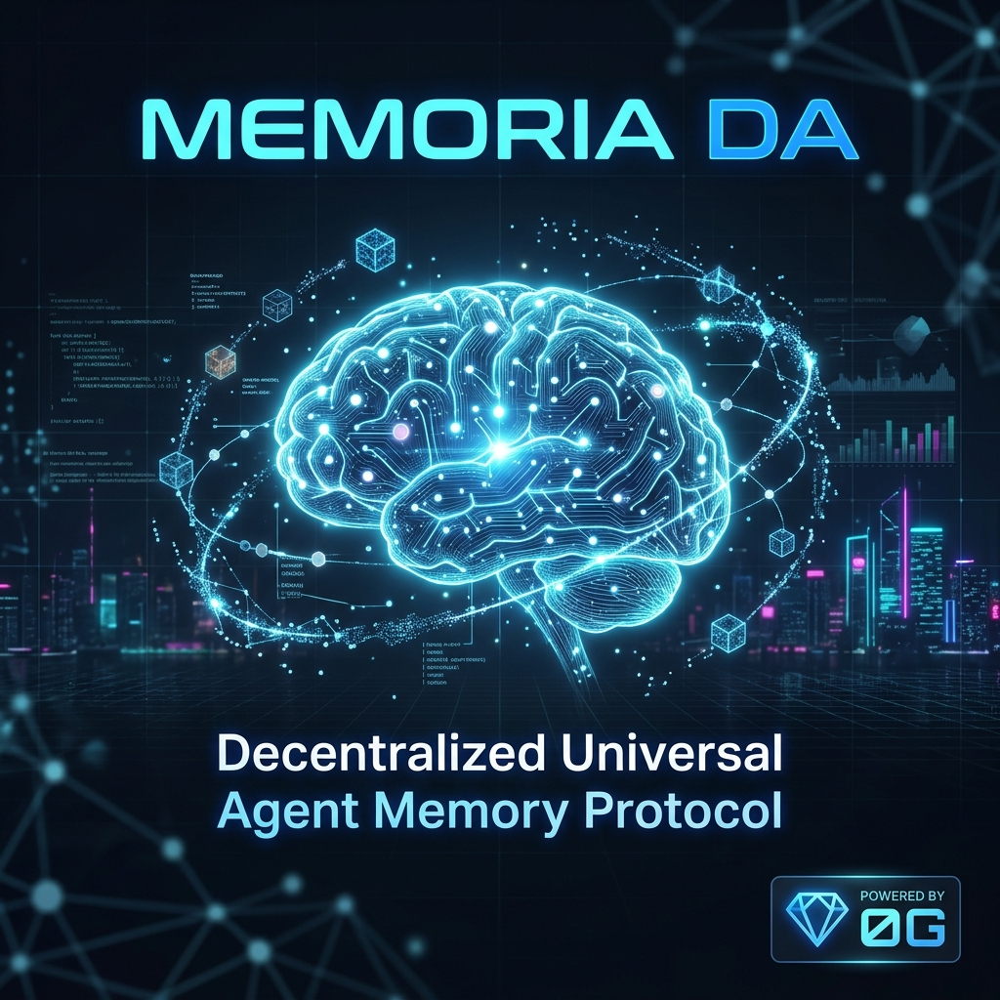

# Memoria DA — Decentralized Universal Agent Memory Protocol

<p align="center">
  
</p>

> **One-Sentence Description (≤30 words):**  
> Memoria DA stores AI agent memories as vector embeddings on 0G Storage, anchors Merkle roots on 0G Chain, and runs inference through 0G Compute's sealed TEE.

---

## What It Does

Memoria DA is a full-stack decentralized memory protocol for AI agents. It solves the problem of **AI amnesia** — agents losing context between sessions because memory is centralized, unverifiable, and siloed.

**How it works:**
1. User chats with an AI agent → conversation is embedded as a 1536-dim vector
2. The vector blob is uploaded to **0G Storage** with Merkle-tree verification
3. The root hash is anchored on **0G Chain** via the `MemoriaRegistry` smart contract
4. On future queries, the agent retrieves relevant memories via cosine-similarity search
5. AI inference runs through **0G Compute** with sealed TEE verification (Qwen 2.5 7B)

**Problem solved:** Agents get permanent, verifiable, decentralized memory that survives across sessions, frameworks, and ecosystems.

**0G Components used:** 0G Storage, 0G Chain, 0G Compute (all three core components integrated).

---

## 0G Integration Proof

| 0G Component | How It's Used | Code Reference |
|---|---|---|
| **0G Storage** | Direct blob upload/download via `@0gfoundation/0g-ts-sdk`. Memory vectors serialized as JSON Merkle blobs. | [`storageService.js`](./src/services/storageService.js) |
| **0G Chain** | `MemoriaRegistry.sol` smart contract maps Agent IDs → Storage root hashes. Deployed on both testnet and mainnet. | [`MemoriaRegistry.sol`](./contracts/MemoriaRegistry.sol) |
| **0G Compute** | Backend broker via `@0glabs/0g-serving-broker` for TEE-verified sealed inference. Qwen 2.5 7B model. | [`computeService.js`](./server/computeService.js) |

### Deployed Contracts

| Network | Contract Address | Explorer |
|---|---|---|
| **0G Testnet (Galileo)** | `0x532Aa5A41ffC5DD039CA1Bc53db7c26F86EfE4A7` | [View on Explorer](https://explorer.0g.ai/testnet/address/0x532Aa5A41ffC5DD039CA1Bc53db7c26F86EfE4A7) |
| **0G Mainnet** | *(deploy with `npm run deploy:mainnet`)* | *(pending deployment)* |

> **Note:** Update this section with the mainnet contract address after running `npm run deploy:mainnet`.

---

## System Architecture

```
┌──────────────────────────────────────────────────────────────┐
│                     FRONTEND (React 19 + Vite 8)             │
│                                                              │
│  ┌──────────────┐  ┌───────────────┐  ┌──────────────────┐   │
│  │  Agent Chat   │  │ Data Terminal │  │ Wallet + Network │   │
│  │  (LLM + RAG) │  │ (Live HUD)    │  │ (MetaMask)       │   │
│  └──────┬───────┘  └───────┬───────┘  └────────┬─────────┘   │
│         │                  │                    │             │
│  ┌──────▼──────────────────▼────────────────────▼──────────┐  │
│  │              Service Layer (Hooks + Services)            │  │
│  │  useWallet · useStorage · useRegistry · useNetwork       │  │
│  └──────┬──────────┬────────────────┬──────────────────────┘  │
└─────────┼──────────┼────────────────┼────────────────────────┘
          │          │                │
   ┌──────▼────┐  ┌──▼─────────┐  ┌──▼───────────┐
   │ 0G Compute │  │ 0G Storage │  │  0G Chain    │
   │ (Sealed    │  │ (Merkle    │  │ (Registry    │
   │  Inference)│  │  Blobs)    │  │  Contract)   │
   │            │  │            │  │              │
   │ TEE-verified│ │ @0g-ts-sdk │  │ Solidity     │
   │ Qwen 2.5 7B│ │ Upload/DL  │  │ 0.8.20       │
   └────────────┘  └────────────┘  └──────────────┘
```

### Data Flow

```
User Message
    │
    ▼
┌─────────────┐     ┌──────────────┐     ┌──────────────┐
│  Embed as   │────▶│  Search Local │────▶│  Build RAG   │
│  1536-dim   │     │  Memory Index │     │  Context     │
│  Vector     │     │  (cosine sim) │     │  Prompt      │
└─────────────┘     └──────────────┘     └──────┬───────┘
                                                │
                                                ▼
┌─────────────┐     ┌──────────────┐     ┌──────────────┐
│  Anchor on  │◀────│  Upload to   │◀────│  0G Compute  │
│  0G Chain   │     │  0G Storage  │     │  Inference   │
│  (Registry) │     │  (Merkle)    │     │  (Sealed)    │
└─────────────┘     └──────────────┘     └──────────────┘
```

---

## Local Deployment / Reproduction Steps

### Prerequisites

- **Node.js** 18+ and npm
- **MetaMask** browser extension
- **0G tokens** — Testnet: [faucet.0g.ai](https://faucet.0g.ai) | Mainnet: real 0G tokens required

### Step 1: Clone & Install

```bash
git clone https://github.com/your-username/memoria-app.git
cd memoria-app
npm install
```

### Step 2: Configure Environment

```bash
cp .env.example .env
```

Edit `.env` with your wallet private key:

```env
VITE_PRIVATE_KEY=0xYOUR_PRIVATE_KEY_HERE

# 0G Compute Backend
ZG_PRIVATE_KEY=0xYOUR_PRIVATE_KEY_HERE
ZG_NETWORK=testnet
ZG_CHAT_PROVIDER=0xa48f01287233509FD694a22Bf840225062E67836
ZG_CHAT_MODEL=qwen/qwen-2.5-7b-instruct
PORT=3001
```

### Step 3: Run the Application

```bash
# Run frontend + backend together
npm run dev:all

# Or run separately:
npm run dev      # Frontend (Vite) — http://localhost:5173
npm run server   # Backend (0G Compute) — http://localhost:3001
```

### Step 4: Test the App

1. Open the app in your browser
2. Click **"ENTER_SYSTEM__❯"** on the landing page to go to the dashboard
3. Click **"Connect Wallet"** — MetaMask will prompt to add 0G network
4. Type a message in the agent chat
5. Watch the Data Terminal for live logs:
   - `QUERY` → your message
   - `VECTOR` → embedding generated
   - `UPLOAD` → storing on 0G Storage
   - `MERKLE` → root hash computed
   - `CONFIRM` → blob committed
   - `CHAIN` → root anchored on-chain

### Step 5: Smart Contract Deployment

```bash
# Compile
npm run compile

# Deploy to testnet
npm run deploy:testnet

# Deploy to mainnet (requires real 0G tokens)
npm run deploy:mainnet
```

After mainnet deployment, update `src/config/network.js` → `mainnet.registryAddress` with the new address.

### Test Account Notes

- Use the 0G Galileo testnet faucet at [faucet.0g.ai](https://faucet.0g.ai) for free test tokens
- The app works in **demo mode** without a wallet (local memory only, no 0G Storage)
- With wallet connected, all operations go through 0G Storage and 0G Chain
- 0G Compute requires the backend server to be running (`npm run server`)

---

## Project Structure

```
memoria-app/
├── contracts/
│   └── MemoriaRegistry.sol       # On-chain Agent → Storage Root mapping
├── scripts/
│   ├── deploy.js                 # Deploy to Galileo testnet
│   └── deploy-mainnet.js         # Deploy to 0G Mainnet
├── server/
│   ├── index.js                  # Express backend (0G Compute bridge)
│   └── computeService.js         # 0G Compute Broker + TEE verification
├── src/
│   ├── components/
│   │   ├── AgentChat.jsx         # AI chat with full RAG pipeline
│   │   ├── DataTerminal.jsx      # Real-time log/memory HUD
│   │   ├── Header.jsx            # Navigation + live block stats
│   │   ├── WalletConnector.jsx   # MetaMask connect/disconnect
│   │   ├── NetworkSwitcher.jsx   # Testnet ↔ Mainnet toggle
│   │   ├── LandingHero.jsx       # Animated hero section
│   │   ├── LandingFeatures.jsx   # Feature grid
│   │   └── LandingArchitecture.jsx # Architecture diagram
│   ├── config/
│   │   ├── constants.js          # ABI, dimensions, upload config
│   │   └── network.js            # Multi-network config (testnet + mainnet)
│   ├── hooks/
│   │   ├── useWallet.js          # Reactive wallet state
│   │   ├── useStorage.js         # 0G Storage operations
│   │   ├── useRegistry.js        # On-chain registry operations
│   │   └── useNetwork.js         # Network selection state
│   ├── services/
│   │   ├── storageService.js     # 0G SDK upload/download
│   │   ├── registryService.js    # Smart contract interactions
│   │   ├── walletService.js      # MetaMask service layer
│   │   ├── computeClient.js      # Frontend → backend bridge
│   │   └── memoryStore.js        # Local cosine-similarity search
│   └── pages/
│       ├── Landing.jsx           # Marketing landing page
│       └── Dashboard.jsx         # Main app dashboard
├── hardhat.config.js             # Solidity compiler + networks
├── vite.config.js                # Vite + polyfills config
└── vercel.json                   # SPA deployment config
```

---

## Tech Stack

| Layer | Technology |
|---|---|
| Frontend | React 19, Vite 8, React Router 7 |
| Styling | Vanilla CSS (Cyberpunk design system) |
| Smart Contract | Solidity 0.8.20, Hardhat 3 |
| Storage | 0G Storage SDK (`@0gfoundation/0g-ts-sdk`) |
| Compute | 0G Compute Broker (`@0glabs/0g-serving-broker`) |
| AI Model | Qwen 2.5 7B (sealed TEE inference via 0G Compute) |
| Wallet | MetaMask (ethers.js v6) |
| Embeddings | 1536-dim deterministic hash vectors |

---

## Key Features

- **🧠 Decentralized Memory Storage** — Every agent conversation stored as a Merkle-verified blob on 0G Storage
- **⛓️ On-Chain Audit Trail** — Root hashes anchored to 0G Chain via `MemoriaRegistry` smart contract
- **🔍 Semantic Memory Retrieval** — Cosine-similarity search across stored embeddings for context-aware AI
- **🔒 Sealed AI Inference** — TEE-verified chat completions via 0G Compute Network
- **🌐 Multi-Network Support** — Seamless switching between 0G Testnet and Mainnet
- **📊 Real-Time HUD** — Live terminal showing every storage operation, Merkle proof, and chain transaction
- **🔌 Framework Agnostic** — Universal memory standard compatible with any agent ecosystem

---

## 📜 License

MIT License — © 2026 MRNETWORK
