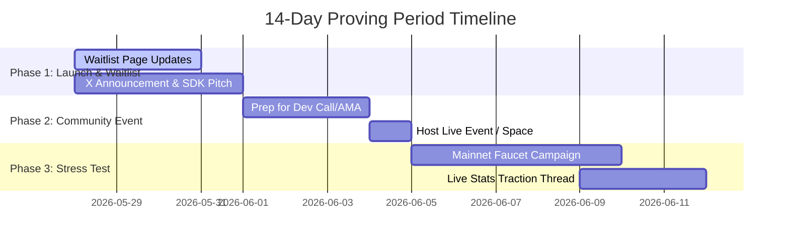

# Memoria DA — Post-Hackathon Growth Plan & Messaging Strategy

The 14-day extension of the results announcement (from tomorrow to June 12th) represents a massive opportunity. In competitive Web3 hackathons (especially infra-heavy ones like 0G), judges often use this buffer to see which projects **immediately go cold** (proving they were just speculative submissions) versus which projects **keep building, shipping, and engaging**. 

By maintaining high visible activity, shipping micro-features/waitlists, and talking about your progress, you present Memoria DA as a **sustainable, production-ready protocol** rather than a weekend demo.

Below is a structured growth plan, complete with concrete waitlist ideas, event blueprints, and copy-pasteable copy for X (Twitter) and Telegram.

---

## 🗺️ The 14-Day Growth Timeline (Overview)



---

## 🚀 Engine 1: Product Strategy — The SDK & Mesh Waitlists

Launching a waitlist shows market demand. It signals to judges that external developers want to build on your memory infrastructure.

### Tactic A: Launch the `@memoria/sdk` Developer Waitlist
* **What it is**: Your roadmap lists **Phase 5: Release `@memoria/sdk`**. Leverage this delay by building a waitlist for developers who want early access to the standalone SDK.
* **Implementation**: Add a sleek, glassmorphic "Join the Waitlist" input form directly on your landing page (`Landing.jsx`) or dashboard (`Dashboard.jsx`), saving signups to a database or Google Sheet. Alternatively, use a clean Google Form or Typeform designed with your cyberpunk aesthetic.

### Tactic B: Launch the "Memoria Mesh" Waitlist for AI Agents
* **What it is**: Pitch the concept of **Memoria Mesh**—a decentralized shared memory network where different AI agents (e.g., a Solana tutor, a trading assistant, and a gaming agent) can discover, query, and share public memory schemas on 0G Storage/Chain.
* **Value for 0G**: This directly showcases the composability of the 0G modular stack, showing how decentralized DA (Storage) and settlement (Chain) enable cross-agent orchestration.

---

## 🎙️ Engine 2: Community Events & Campaigns

Hosting community-driven activities creates quantifiable onchain activity. Since you are live on **0G Aristotle Mainnet**, you can drive real transaction spikes.

### Event Option 1: "Memoria DA Builder Hour" (AMA / X Space)
* **What it is**: A live 45-minute audio session on X Spaces or Telegram Voice Chat.
* **Topic**: *Decentralized Agent Memory: Building with 0G Storage, Chain, & Compute.*
* **Agenda**:
  1. **The Problem (10 min)**: AI Amnesia and why centralized APIs fail agent workflows.
  2. **The Architecture (15 min)**: Walkthrough of how Memoria DA integrates 0G's three core pillars.
  3. **Live Demonstration (10 min)**: Show MetaMask network configuration, agent NFT minting, and the real-time Data Terminal.
  4. **Q&A & SDK Waitlist Launch (10 min)**.
* **Target Audience**: Other hackathon participants, 0G community members, and Web3 developers.

### Event Option 2: "Mainnet Memory Stress Test" Campaign
* **What it is**: A community challenge to stress-test your protocol on the 0G Aristotle Mainnet.
* **Execution**:
  1. Announce a 72-hour stress-test on your X and Telegram.
  2. Direct users to your gasless faucet (`faucet.memoriada.xyz`) to grab 0G testnet/mainnet tokens.
  3. Ask them to register an agent and chat with the MemoriaDA flagship agent.
  4. Have them verify their Merkle root using your **Merkle Verifier** tool and post a screenshot of their transaction on your Telegram.
  5. Offer a custom role (e.g., `0G Memory Pioneer`) in your Telegram/Discord channel.
* **Outcome**: This will cause a massive spike in verified onchain activity on your contract address (`0xD896D59583C137D6ca2c5e3add025e143eD1030d`), which judges will see on the 0G Explorer.

---

## ✍️ X (Twitter) Copywriting & Thread Toolkit

High-quality technical threads are the fastest way to get noticed by 0G core developers and marketing accounts, who frequently retweet builders showcasing their tech.

### Thread 1: The Technical Integration Thread (Deep-Dive)
* **Goal**: Show absolute mastery of the 0G stack. Explain *how* and *why* you built it.
* **Visual asset**: Post a diagram of your architecture or a clean code screenshot of `computeService.js` and `storageService.js`.

> [!TIP]
> **Copy-paste template below for Thread 1:**

```text
1/ AI agents suffer from amnesia. Centralized memory creates corporate silos, lacks audit trails, and breaks between sessions.

We built @MemoriaDA to solve this—giving any AI agent permanent, verifiable, decentralized memory. 

Here is how we integrated the modular @0G_Platform stack 🧵👇

2/ Memoria DA relies on three core pillars of the 0G ecosystem to run a decentralized RAG pipeline:
• 0G Storage for Merkle-verified memory blobs
• 0G Chain for onchain settlement and identity anchoring
• 0G Compute for sealed TEE-verified AI inference

Let's look at the code:

3/ [Insert/Attach Code Screenshot of storageService.js]
Every agent message is embedded as a 1536-dim vector. We serialize the vector index as JSON Merkle blobs and upload them directly to 0G Storage using the `@0gfoundation/0g-ts-sdk`. High throughput, ultra-low cost.

4/ [Insert/Attach Code Screenshot of MemoriaRegistryV2.sol]
Every registered agent gets an ERC-721 Agent NFT. On future conversations, the Merkle root hash of the memory is anchored on the 0G Chain. Each anchor charges a micropayment fee of 0.001 0G, establishing a native monetization protocol.

5/ For AI inference, we integrate the 0G Compute Router API.
All chat interactions run through the `0GM-1.0-35B-A3B` model (a 35B MoE reasoning model). 
No OpenAI. No Anthropic. Fully native, verifiable AI execution.

6/ We are officially LIVE on 0G Aristotle Mainnet!
• Contract: 0xD896D59583C137D6ca2c5e3add025e143eD1030d
• Live apps: 4 custom domains (Protocol, SolTutor, Faucet, Blog)
• 100+ onchain TXs already processed

Check out our Global Memory Explorer ➡️ memoriada.xyz/app

7/ We’re releasing the standalone `@memoria/sdk` and launching the Memoria Mesh waitlist. 

If you are building AI agents on ElizaOS, Rig, or OpenClaw and want persistent, cross-framework memory, join our developer waitlist now:
🔗 [Insert Waitlist Link]

Tagging the builders: @0G_Platform @HackQuest
```

---

### Thread 2: The Developer SDK & Waitlist Announcement
* **Goal**: Announce the waitlist and tease how easy it is to integrate.

> [!TIP]
> **Copy-paste template below for Thread 2:**

```text
1/ Web3 AI agents are exploding, but developers are still building custom, centralized databases to save session states.

We’re changing that. 

Introducing the @MemoriaDA SDK waitlist: persistent, decentralized agent memory with just 3 lines of code. 🧵👇

2/ Centralized databases are a single point of failure for autonomous agents. 

By utilizing @0G_Platform’s decentralized storage and EVM settlement, the Memoria SDK allows your agent to save vectors, compile Merkle roots, and anchor them onchain with zero infrastructure setup.

3/ Here's how simple it is:
1. `npm install @memoria/sdk`
2. `await memoria.uploadMemory(payload)` -> commits vectors to 0G Storage
3. `await registry.anchorRoot(agentId, rootHash)` -> settles root hash on 0G Chain

4/ To prove the infrastructure is real, we built SolTutor (soltutor.memoriada.xyz)—an AI Solidity tutor that tracks developer progress across sessions. 

Additionally, our partner @AlphaJournal (alphajournal.online) integrates MemoriaDA as its decentralized diary backend.

5/ Want to give your agent permanent memory? 
Join the developer waitlist today for early SDK access:
🔗 [Insert Waitlist Link]

Let's build a censorship-resistant, decentralized memory layer for the global agentic ecosystem. 🧠🌐
@0G_Platform @HackQuest
```

---

## 💬 Telegram Builder Channel Messaging Strategy

Judges and core developers monitor the official Hackquest and 0G builder groups. Posting clear, value-first updates will get them talking.

### Rules of Engagement:
1. **Never say "Please vote for us"** or spam your link. 
2. **Focus on technical milestones**: Share transaction counts, mainnet contracts, architectural breakthroughs, or user stats.
3. **Keep it brief**: Use bullet points and link to your X thread or website.

### Post Template 1: The Mainnet Milestones Update (For Hackquest / 0G General Chat)
> "Hey fellow builders! 🧠 
> Just wanted to share some updates on **Memoria DA** (our universal agent memory protocol built on 0G Storage, Chain, & Compute).
> 
> We transitioned fully to **0G Aristotle Mainnet** and just hit some exciting milestones:
> • **106+ Onchain Transactions** settled on 0G Mainnet
> • **21+ Agents registered** (minted as ERC-721 identity NFTs)
> • **2 Integration Partners** (AlphaJournal & SolTutor) live on custom domains
> 
> If you have an active MetaMask wallet configured for 0G Mainnet, you can check out our Global Memory Explorer: https://memoriada.xyz/app
> 
> We are also opening a developer waitlist for our upcoming `@memoria/sdk` package for builders using ElizaOS / Rig frameworks. Check out our deep dive thread: [Link to X Thread]"

### Post Template 2: Technical Inquiry / Feature Update (For 0G Developers Channel)
> "Hey dev team! We've been building out the OpenClaw skill adapter for **Memoria DA** on 0G Aristotle Mainnet. 
> 
> During our integration of the `0GM-1.0-35B-A3B` reasoning model on 0G Compute, we noticed it handles the separation of `reasoning_content` and final `content` really well. We built a custom fallback parsing system for developers in our server layer to handle this gracefully: https://github.com/mrnetwork0001/MemoriaDA/blob/main/server/computeService.js
> 
> If anyone is building agents and trying to implement persistent memory or state-snapshotting on 0G, feel free to read our integration blog post! Always open to feedback: https://memoriada.xyz/blog"

---

## 🛠️ Step-by-Step Execution Plan

To execute this strategy successfully over the next 14 days, follow these steps:

1. **Step 1 (Days 1-2)**: Add a simple Google Form or a custom email signup section to `Landing.jsx` under the partner list. Label it: `JOIN_SDK_WAITLIST__❯`.
2. **Step 2 (Day 3)**: Post **Thread 1 (Technical Integration)** on X. Tag 0G, Hackquest, and key 0G builders.
3. **Step 3 (Day 4)**: Share a summary of the thread in the Hackquest and 0G Telegram chats using **Post Template 1**.
4. **Step 4 (Days 5-7)**: Setup a simple Google Meet / Zoom link, create an X Space event, and schedule a **Live Builder Walkthrough**. Post the invite on X and Telegram.
5. **Step 5 (Day 8)**: Host the Live Space/Meet. Walk through the code, show the dashboard, and share your screen.
6. **Step 6 (Day 9)**: Post **Thread 2 (SDK Launch)**, and follow up in Telegram chats with **Post Template 2**.
7. **Step 7 (Days 10-12)**: Run the **Mainnet Stress Test Campaign**, encouraging your community/testers to generate onchain transaction activity on your live mainnet contract.
8. **Step 8 (Day 13)**: Post a final recap thread of your 14-day activity, showing a growth chart of onchain transactions and waitlist signups, proving your sustainability before the winners are announced.
